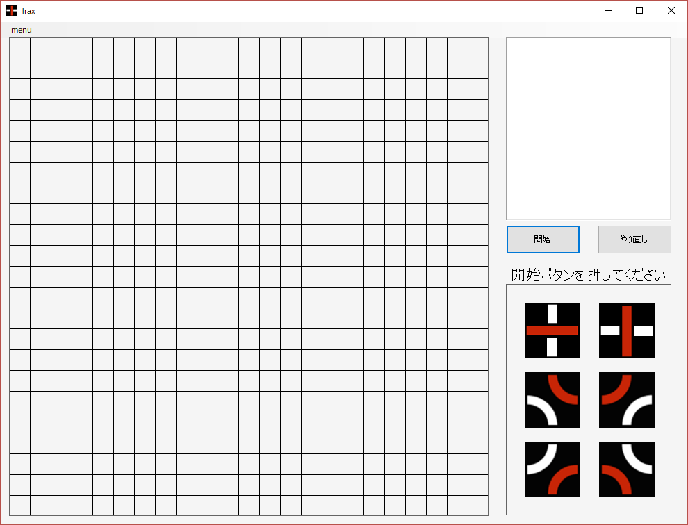

test
# AI付きTraxPlayer

## Trax とは

 

裏表に上記2種類の模様が描かれたタイルを使用し、2人のプレイヤーがこれらを交互に並べていくゲームです。それぞれのプレイヤーには赤または白の色が割り当てられ、自分の色のラインでループ、または条件を満たしたラインを作ったプレイヤーの勝利となります。

詳細については[公式HP](http://www.tantrix.jp/trax/trax_rule.htm)を参照してください。

## 使い方

NSTraxPlayer.exe を実行すると最初に上記画像の画面が開かれます。

開始ボタンを押すと、先後が自動で決定され、プレイヤー先手の場合は設置できる箇所が黄緑で示され、CPU先手の場合は真ん中に自動でタイルが設置されます。

プレイヤーのターンになったならば、配置するタイルの種類を右下から選択し、すでに配置されているタイルに隣接するマスをクリックしてください。これでプレイヤーターンは終了し、次手をCPUが自動で配置します。

勝敗が決すると、ポップアップが表示されます。

右上窓に出力されているものは、Trax Notationと呼ばれるTraxの棋譜です。

menu > AIの強さ からAIの強さを指定することができます。強くするほど思考時間が長くなるため、もっと強いは指定しないほうがいいです。

## 実行環境
VisualStudio C#で作成しており、Windowsで動作します。